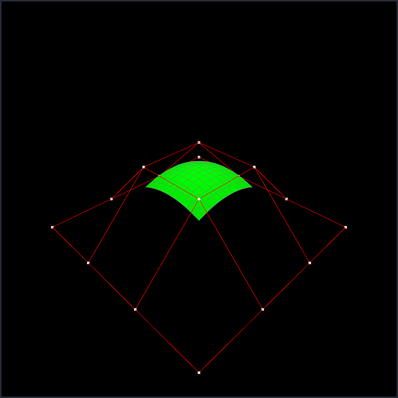
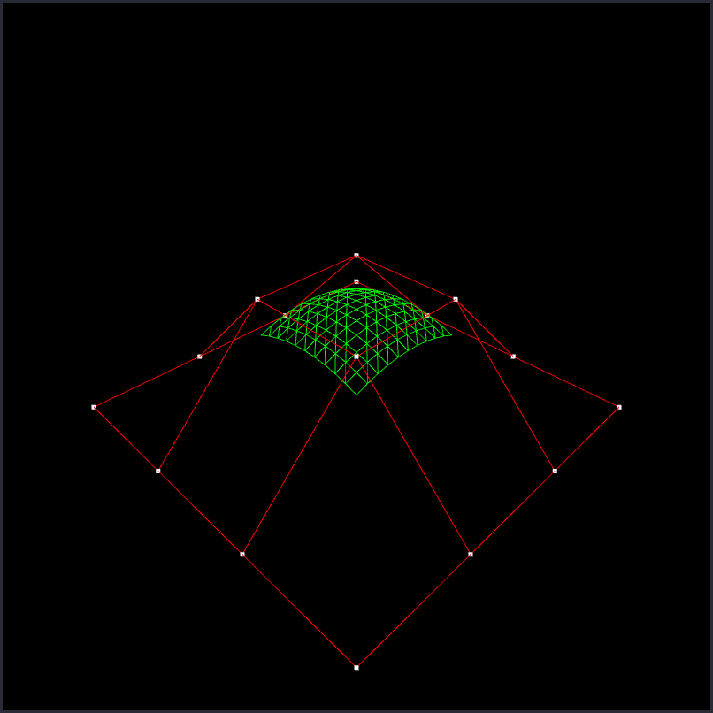
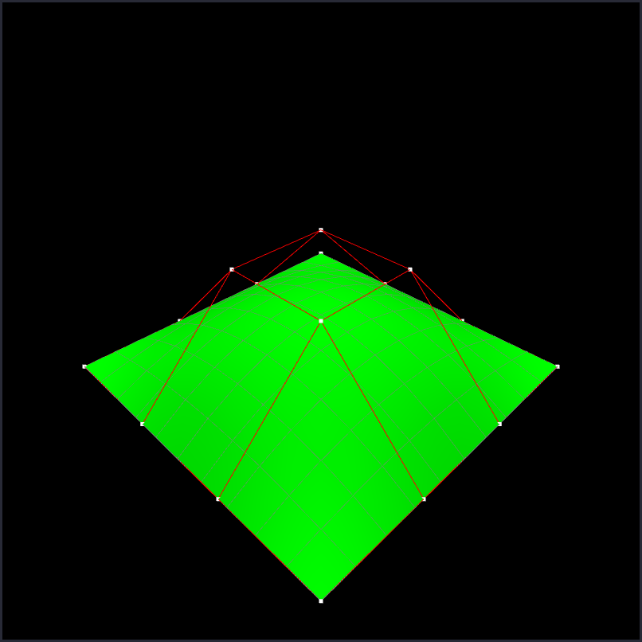
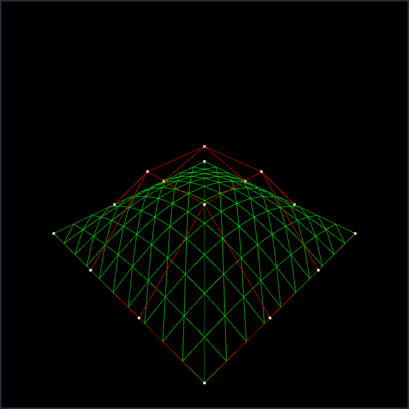
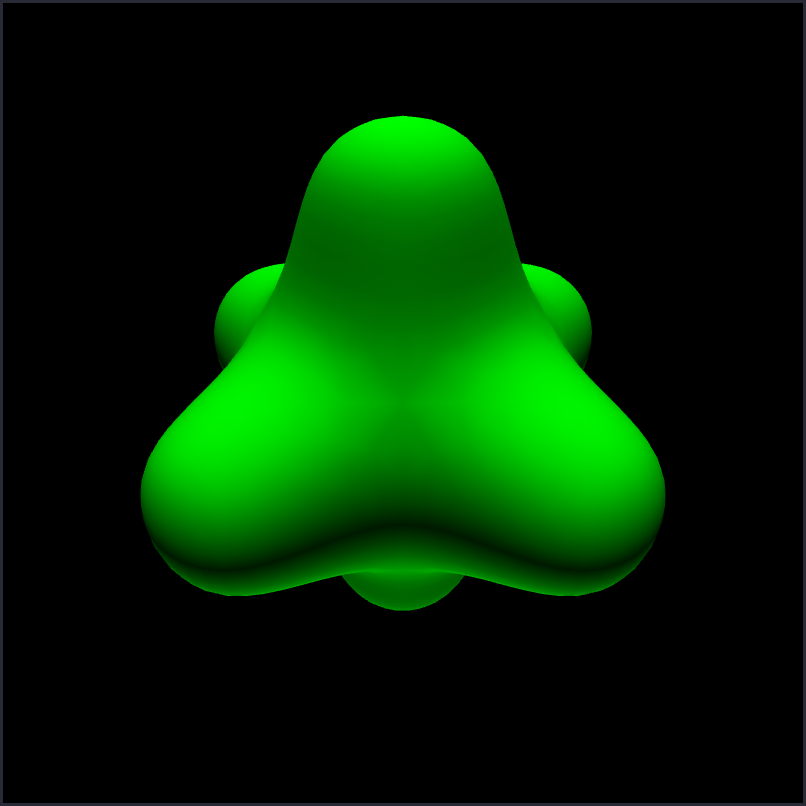
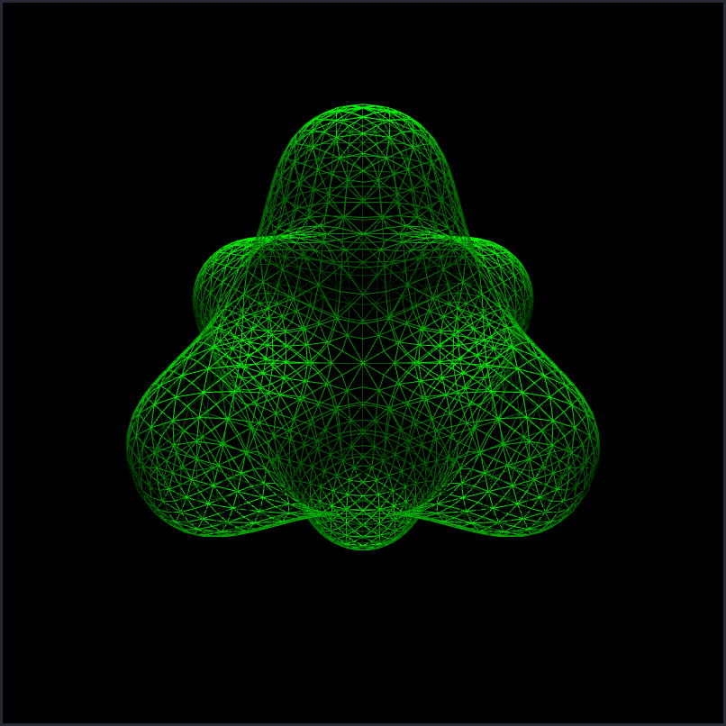

# Computer Graphics: Programming Assignment 2

> Yongun seong 2017-19937

## Overview

I implemented a simple tool that accepts `.obj` files, processes them in one of
four modes, and renders the output.

The two spline modes (bezier, bspline) accept a 4x4 grid of vertices, and
compute the appropriate surface. It allows dragging the control points with the
mouse on the screen. In particular, our implementation reconstructs the 4x4
grid, even when the obj file is scrambled.

In the Catmull-Clark mode, it performs the specified rounds of Catmull-Clark
subdivision. This mode can also be used to draw objects with no processing, by
specifying zero rounds.

For rendering, calculate vertex normals and light the object from both above and
below, without culling faces. The viewing camera is always pointed to the
origin, and the view can be rotated with the mouse.

## Usage

```console
$ ./main.py
usage: ./main.py {bezier | bspline | catmullclark} <count> <input.obj> [output.obj]
# output is optional

# draw bezier surface with 10 segments
$ ./main.py bezier 10 grid.obj output.obj

# draw bspline surface with 20 segments
$ ./main.py bspline 20 grid.obj output.obj

# draw catmull-clark mesh, three rounds
$ ./main.py catmullclark 3 input.obj output.obj

# draw the object without doing anything
$ ./main.py catmullclark 0 input.obj
```

## Controls

- Zoom in/out with scroll wheel
- Rotate with right click drag
- If mode is bezier or bspline, left click drag to move points
- Toggle wireframe with space
- Quit (and save output) with escape

## Screenshots












