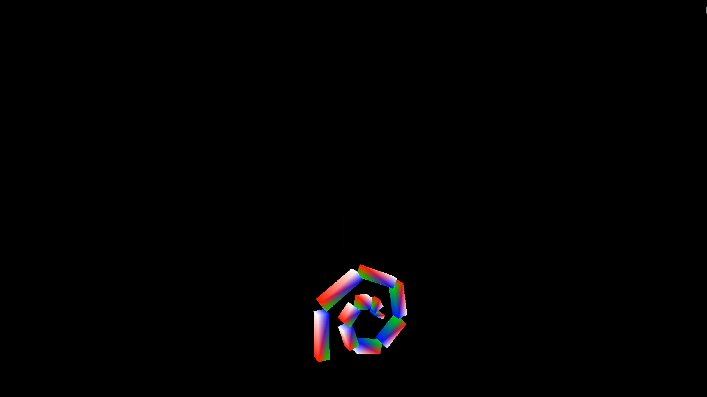

# Programming Assignment 1

> Yongun Seong 20171-9937

For this assignment, I implemented a basic hierarchical model with a very simple
animation to demonstrate the technique. My model is very simple, a series of
elongated cubes of decreasing length, that are connected end-to-end. When
animated, the angle at each joint oscilates periodically.

To do this, I implemented a "Joint" data structure in the `skel.py` file, which
contains references to parent joints, its "fixed" transformation, and its "free"
transformation. Before passing each shape into the renderer, I also pass in its
joint, which is used to calculate its complete transformation in the world
space.

On each animation frame, each joint "advances" by `dt`, where the free
transformation is set to an angle rotation.

## Usage

```console
$ python main.py
# press space to start animation
```

## Screenshot


