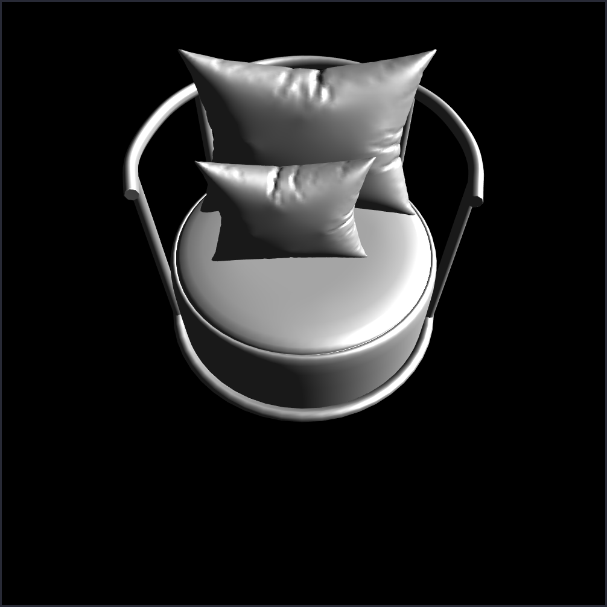

# Programming Assignment 3

> Yongun Seong 2017-19937

For this assignment, I implemented a program to render wavefront `.obj` files
with phong lighting. I only included the Phong shading code, though I had also
tested with Gouraud shading. Though there were differences between the two
outputs, the differences were minor.

## Usage

```console
# obj: Free_rock.obj or Chair.obj
# x, y, z: the camera location, looking at 0, 0, 0
# mode:
#   0: wireframe
#   1: untextured
#   2: textured
#   3: normal mapping
# for debugging, press Space, '.', ',' to rotate
$ ./main.py [obj] [x y z] [mode]

# for example:
$ ./main.py Free_rock.obj -10 10 10 0
$ ./main.py Chair.obj -1 2 1 3
```

## References

I used the free "Sofa Chair" asset from turbosquid:

`https://www.turbosquid.com/3d-models/3d-model-sofa-chair-2194116`





