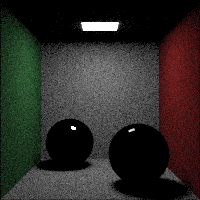

# Programming Assignment 4

> Yongun Seong 2017-19937

I implemented a simple ray (path) tracer.

For for each pixel, I shoot a ray from the camera, gathering contributions from
each bounce. I did not implement shadow rays, and instead chose to use a large
number of samples to reduce noise. I initially intended to implement biasing
rays towards the light or other light-bending objects, but I gave up midway.

I only implemented a single Cornell box-like scene. It has a single square light
source on the ceiling, walls, and two spheres. The left further sphere is
perfectly reflective, while the right near sphere is perfectly refractive.

## Usage

I only implemented the cornell box.

### Prerequisites

- Numba
- Pillow
- Scipy

It in intended to be run with nix, but for convenience, you can use the the
pytorch docker image for testing.

You can enable `DEBUG=1` and use `pv` to track progress. It takes 30s~1m at
startup for JIT compilation.

```console
# Local, 200x200 with 100 samples, 5 bounces
# Takes about 1m on an AMD Ryzen 7 5800X
$ DEBUG=1 \
    WORKERS=$(nproc) \
    IMAGE_WIDTH=200 IMAGE_HEIGHT=200 \
    MAX_SAMPLES=100 MAX_DEPTH=5 \
    ./main.py \
    | pv -l -s $(( 200 * 200 * 100 )) >/dev/null

# Docker, 1000x1000 with 5000 samples, 10 bounces
# Takes about 4 hours
$ docker run --rm \
    -v $(pwd):/data -w /data \
    nvcr.io/nvidia/pytorch:24.05-py3 bash -c '
        WORKERS=$(nproc) \
        IMAGE_WIDTH=1000 IMAGE_HEIGHT=1000 \
        MAX_SAMPLES=5000 MAX_DEPTH=10 \
        ./main.py'
```

## Depth (bounces)

I did not implement direct light sampling, or bias my rays towards the light.
This means that only the direct light sources are visible in 1-depth renders.
At 2-depth, most objects are lit, but the ceiling is still dark, as well as
reflections. With 4 bounces, most effects are present. The only exception is the
reflected refraction, which requires more bounces to be visible.





## Samples

For the same reason as above, low-sample renders are very noisy, as we fail to
sample the light for most rays. As we increase the number of samples, the image
becomes better.


## Submission


## References

I heavily referenced the "Ray Tracing in One Weekend" book series, available
online at <https://raytracing.github.io>.
